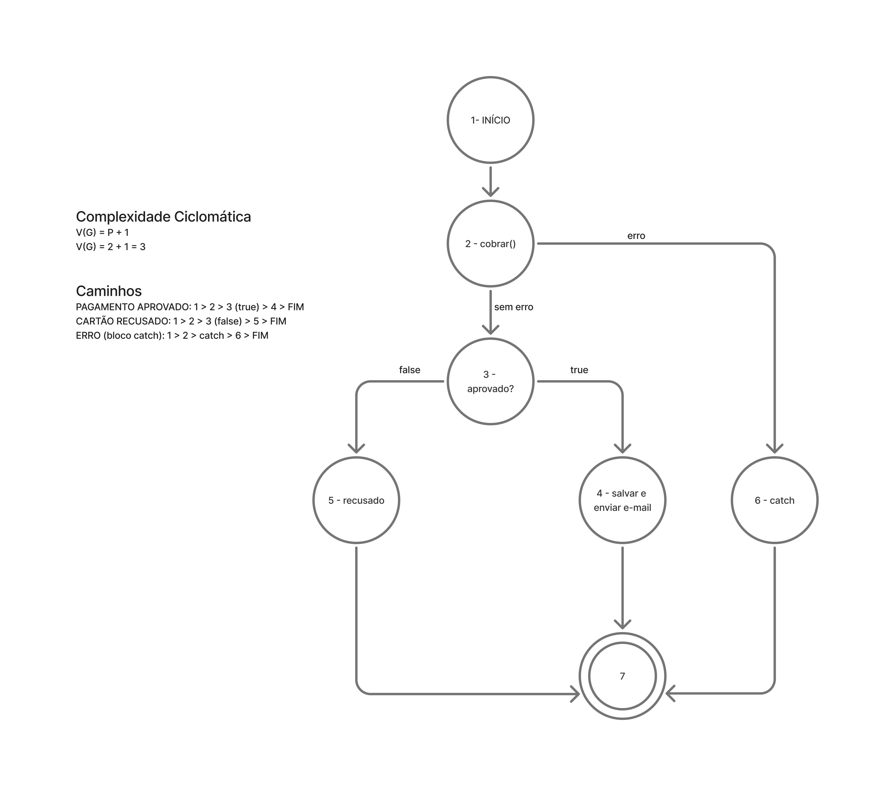

# O Apocalipse do Delivery

## Fase 1: Análise Estrutural, Complexidade e Métricas de Estimativa

### Mapeamento de Fluxo:

O Grafo de Fluxo de Controle representa os principais caminhos de execução do método de processamento de pedidos.



O fluxo inicia no nó 1, passa pela chamada ao gateway de pagamento no nó 2 e segue para a verificação de aprovação no nó 3. A partir desse ponto, existem três caminhos principais:

1. Pagamento aprovado.
2. Pagamento recusado.
3. Erro ou exceção durante a cobrança.

#### Nós do Grafo

| Nó  | Descrição                                          |
| --- | -------------------------------------------------- |
| 1   | Início do processamento                            |
| 2   | Chamada ao método cobrar() do gateway de pagamento |
| 3   | Verificação se o pagamento foi aprovado            |
| 4   | Salvar pedido e enviar e-mail                      |
| 5   | Fluxo de pagamento recusado                        |
| 6   | Tratamento de erro no bloco catch                  |
| FIM | Encerramento do processamento                      |

#### Caminhos Independentes

| Caminho             | Descrição                          |
| ------------------- | ---------------------------------- |
| 1 → 2 → 3 → 4 → FIM | Pagamento aprovado                 |
| 1 → 2 → 3 → 5 → FIM | Pagamento recusado                 |
| 1 → 2 → 6 → FIM     | Erro ou exceção durante a cobrança |

Esses três caminhos representam os cenários mínimos que precisam ser cobertos por testes para exercitar todos os fluxos principais do método.

### Complexidade Ciclomática

Cálculo da complexidade ciclomática:

V(G) = P + 1
V(G) = 2 + 1 = 3

### Métricas e Estimativas de Teste

#### Objetivo

Esta seção apresenta uma estimativa do esforço necessário para testar a funcionalidade de **Processamento de Pedidos e Checkout** da plataforma EntregasJá.

A estimativa considera os principais riscos do sistema: falha no gateway de pagamento, falha no cache, erro de persistência, envio incorreto de e-mail e degradação de desempenho durante alta carga.

#### Base da Estimativa

A análise estrutural do método principal de checkout indicou uma **Complexidade Ciclomática V(G) = 3**.

Isso significa que existem, no mínimo, **três caminhos independentes** que precisam ser cobertos por testes:

| Caminho             | Cenário                    | Resultado esperado                              |
| ------------------- | -------------------------- | ----------------------------------------------- |
| 1 → 2 → 3 → 4 → FIM | Pagamento aprovado         | Pedido salvo como processado e e-mail enviado   |
| 1 → 2 → 3 → 5 → FIM | Pagamento recusado         | Pedido marcado como falhou e e-mail não enviado |
| 1 → 2 → 6 → FIM     | Erro ou exceção no gateway | Erro tratado de forma controlada                |

Esses caminhos representam a base mínima da suíte de testes.

#### Técnica Utilizada

Foi utilizada uma técnica baseada em **Pontos de Caso de Teste**, adaptada ao contexto do trabalho.

Cada cenário recebeu um peso conforme sua complexidade:

| Classificação |     Peso | Critério                                                        |
| ------------- | -------: | --------------------------------------------------------------- |
| Simples       |  1 ponto | Fluxo direto, baixa dependência externa                         |
| Médio         | 2 pontos | Uso de mocks, stubs, persistência ou validação de comportamento |
| Complexo      | 3 pontos | Falhas externas, timeout, mutação, performance ou caos          |

A fórmula usada foi:

```text
Esforço estimado = Pontos de Caso de Teste × 2 horas/homem
```

#### Casos de Teste Planejados

| ID   | Cenário                                         | Tipo                | Complexidade | Pontos |
| ---- | ----------------------------------------------- | ------------------- | ------------ | -----: |
| CT01 | Pagamento aprovado                              | Unitário/Integração | Médio        |      2 |
| CT02 | Pagamento recusado                              | Unitário/Integração | Médio        |      2 |
| CT03 | Erro no gateway                                 | Unitário/Integração | Complexo     |      3 |
| CT04 | Timeout do gateway                              | Integração          | Complexo     |      3 |
| CT05 | E-mail enviado apenas em caso de sucesso        | Mock                | Médio        |      2 |
| CT06 | Persistência correta do pedido                  | Integração          | Médio        |      2 |
| CT07 | Cenários BDD em Gherkin                         | BDD                 | Médio        |      2 |
| CT08 | Teste de mutação com Stryker.js                 | Mutação             | Complexo     |      3 |
| CT09 | Ajustes para matar mutantes sobreviventes       | Mutação             | Complexo     |      3 |
| CT10 | Teste de carga com ramp-up, steady e ramp-down  | Performance         | Complexo     |      3 |
| CT11 | Teste de estresse na volumetria de Black Friday | Performance         | Complexo     |      3 |
| CT12 | Gateway lento com 5000ms de latência            | Caos                | Complexo     |      3 |
| CT13 | Queda ou flush do cache durante carga máxima    | Caos                | Complexo     |      3 |
| CT14 | Degradação graciosa e cálculo de MTTR           | SRE                 | Complexo     |      3 |

**Total:** 37 pontos de caso de teste.

#### Estimativa de Esforço

Considerando o fator de **2 horas/homem por ponto**, temos:

```text
37 pontos × 2 horas = 74 horas/homem
```

Portanto, o esforço total estimado para testar a funcionalidade é de aproximadamente:

```text
74 horas/homem
```

#### Distribuição do Esforço

| Atividade                                       | Esforço estimado |
| ----------------------------------------------- | ---------------: |
| Análise do código legado e grafo de fluxo       |               4h |
| Cálculo da complexidade ciclomática             |               1h |
| Planejamento dos casos de teste                 |               3h |
| Escrita dos cenários BDD                        |               4h |
| Testes unitários e de integração                |              14h |
| Implementação de mocks, stubs e builders        |               5h |
| Refatoração do CheckoutService                  |               8h |
| Teste de mutação com Stryker.js                 |               9h |
| Testes de carga e estresse                      |               8h |
| Injeção de falhas com Toxiproxy                 |               8h |
| Análise de métricas, MTTR e degradação graciosa |               5h |
| Relatório e preparação do vídeo                 |               5h |
| **Total**                                       |          **74h** |

#### Recursos Necessários

| Recurso          | Finalidade                                                |
| ---------------- | --------------------------------------------------------- |
| Node.js e npm    | Execução do microsserviço e gerenciamento de dependências |
| Jest             | Testes unitários e de integração                          |
| Gherkin/Cucumber | Especificação BDD dos cenários                            |
| Stryker.js       | Teste de mutação                                          |
| k6 ou Autocannon | Testes de carga e estresse                                |
| Toxiproxy        | Injeção de falhas de rede                                 |
| Docker           | Execução de serviços auxiliares                           |
| Banco relacional | Persistência dos pedidos                                  |
| Cache            | Simulação do cenário de Thundering Herd                   |
| GitHub           | Versionamento e entrega do trabalho                       |

#### Indicadores Esperados

| Indicador                       | Meta                           |
| ------------------------------- | ------------------------------ |
| Caminhos independentes cobertos | 100%                           |
| Mutation Score                  | ≥ 90%                          |
| Latência p95                    | < 5 segundos                   |
| Taxa de erro                    | < 5%                           |
| E-mail de confirmação           | Apenas em pagamento aprovado   |
| Falha no gateway                | Tratada sem derrubar o sistema |
| Falha no cache                  | Degradação graciosa            |
| MTTR                            | Medido após a falha            |

#### Conclusão

A estimativa indica que a funcionalidade de Checkout exige aproximadamente **74 horas/homem** para ser testada de forma completa.

Embora a complexidade ciclomática indique apenas três caminhos mínimos, o contexto do trabalho exige testes adicionais de resiliência, mutação, desempenho e caos, pois o sistema depende de componentes externos críticos, como gateway de pagamento, cache e banco de dados.

## Fase 2: Redesenho com TDD, BDD e Padrões de Projeto

## Fase 3: Teste de Mutação

## Fase 4: Engenharia do Caos e Testes de Desempenho (SRE)
